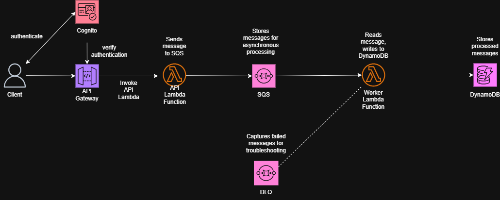

# Serverless Event-Driven System on AWS

This project is a fully serverless, event-driven architecture built on AWS. It demonstrates how to design scalable, decoupled, fault-tolerant cloud applications using managed services such as API Gateway, Lambda, SQS, DynamoDB, CloudWatch, and optional Cognito authentication.

---

## Architecture Diagram

---

## What I Built, Why I Built It, and What Problem It Solves

### What I Built
I built a fully serverless, event-driven system on AWS using API Gateway, Lambda, SQS, DynamoDB, CloudWatch, and optional Cognito authentication. The system accepts client requests, queues them for processing, executes asynchronous workflows, and stores the final results in DynamoDB.

### Why I Built It
I wanted to create a production-style cloud architecture that demonstrates real-world patterns such as event-driven processing, decoupling, scalable serverless compute, and reliable message handling. This project also reinforces Infrastructure as Code practices and AWS resource provisioning workflows.

### What Problem It Solves
This design solves a common challenge in distributed systems: processing unpredictable workloads without breaking under load. By placing SQS between the API and processing layers, the system prevents overload, handles asynchronous tasks cleanly, and ensures that no messages are lost even during traffic spikes. It models how organizations build resilient systems using fully managed AWS services.

---

## How the System Works

1. The client first authenticates with Amazon Cognito and receives a valid JWT access token.
2. The client sends an HTTP POST request to API Gateway, including the Cognito JWT in the Authorization header.
3. API Gateway verifies the JWT against the Cognito User Pool and only forwards valid, authenticated requests to the Lambda ingest function.
4. The ingest Lambda generates a unique id and pushes a message containing the request data into the SQS queue.
5. SQS automatically triggers the processor Lambda. Each queued message is processed independently and at scale.
6. The processor Lambda writes the processed result to the DynamoDB table serverless-event-driven-system-items.
7. CloudWatch Logs record all Lambda executions, errors, retries, and SQS processing activity.

---

## Key AWS Services Used

- API Gateway
- AWS Lambda
- Amazon SQS
- Amazon DynamoDB
- Amazon CloudWatch
- Amazon Cognito
- AWS CLI and IaC tooling

---

## Deployment
Build the lambda zips, cd into `infrastructure`, then run:
terraform init && terraform apply -auto-approve

## How to Test the System

### 1. Send a message to the API

Replace <INVOKE_URL> with your actual invoke URL:

curl -X POST "<INVOKE_URL>/messages" \
  -H "Content-Type: application/json" \
  -d '{ "message": "test message" }'

You will receive a JSON response containing the generated id.

### 2. Confirm the item exists in DynamoDB

Check manually in the AWS Console:

- Go to DynamoDB
- Open the table serverless-event-driven-system-items
- Search for the id returned from the API
- You should see the stored item such as {"message":"test message"}

---

## Repository Structure

architecture.png  
infrastructure/  
lambdas  
README.md
serverless-event-driven-system.png

---

